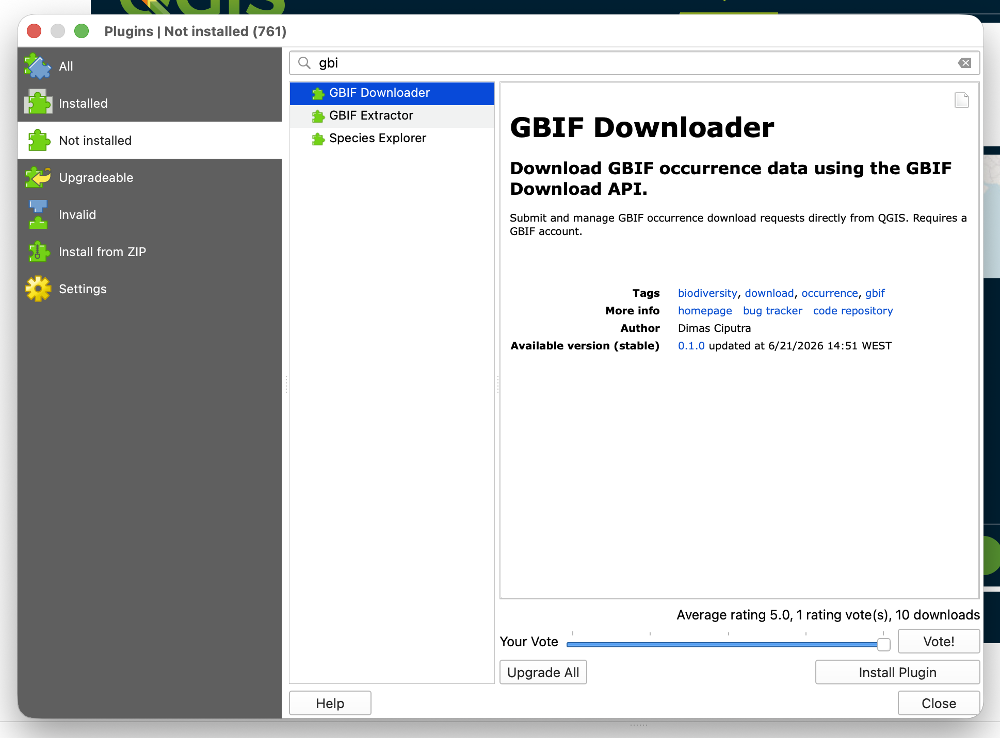
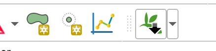
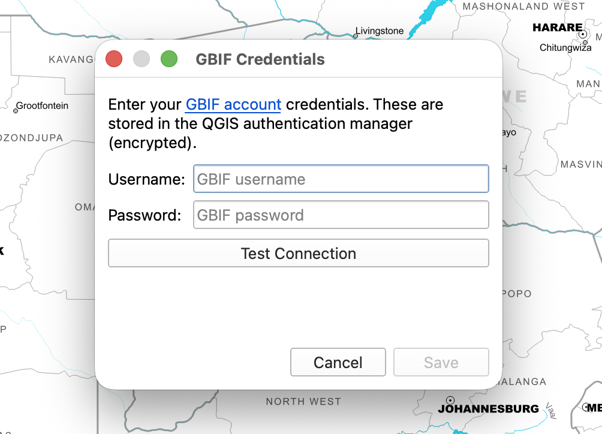
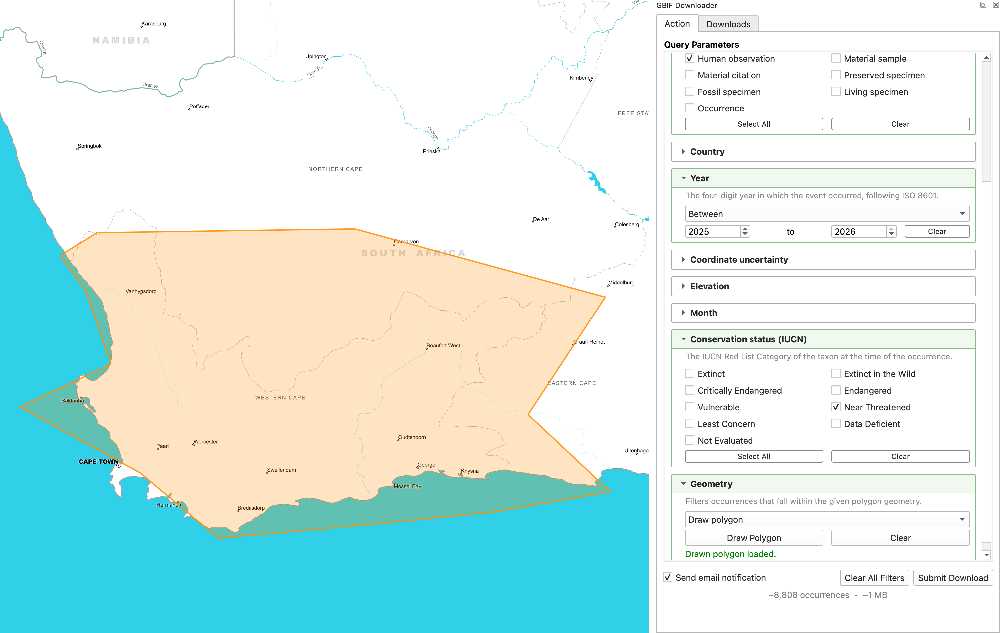
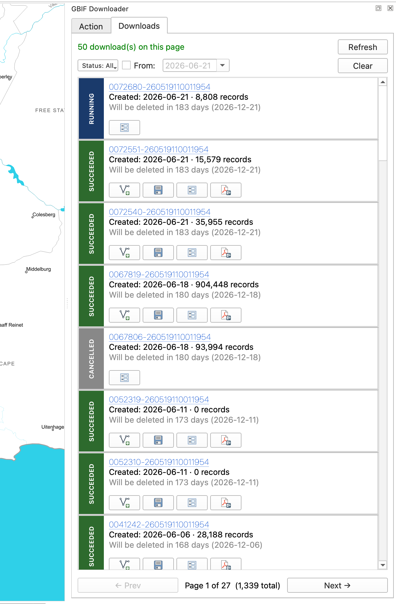
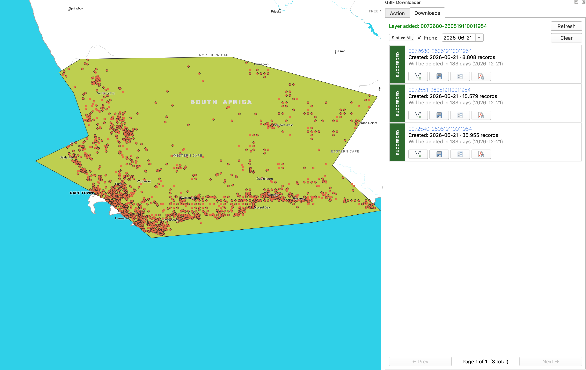
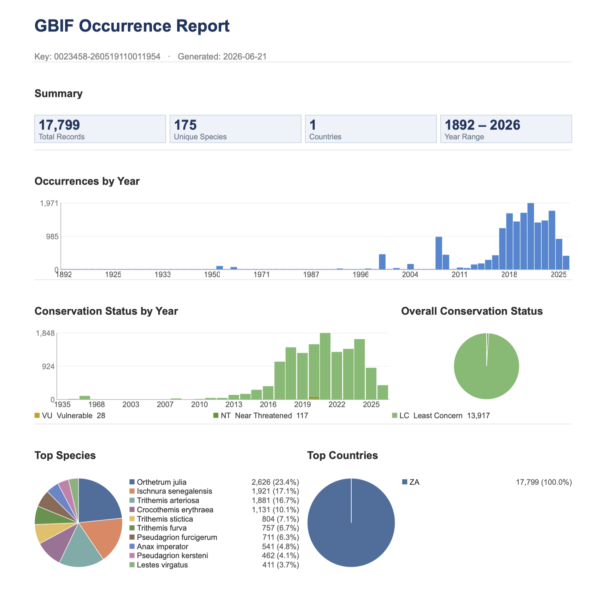

# GBIF Downloader for QGIS

Submit and manage GBIF occurrence download requests directly from QGIS. No API knowledge required.

[GitHub Repository](https://github.com/dimasciput/gbif-downloader-qgis-plugin){ .md-button }
[GBIF](https://www.gbif.org/){ .md-button }

---

## Requirements

- **QGIS 3.28 or newer** (including QGIS 4.x / Qt 6). [Download QGIS](https://qgis.org/download/)
- A free **GBIF account**. [Register at gbif.org](https://www.gbif.org/user/profile)
- No additional Python packages required.

---

## Step 1: Install the Plugin

### From the QGIS Plugin Repository (easiest)

1. Open QGIS and go to **Plugins > Manage and Install Plugins**.
2. Search for **GBIF Downloader**.
3. Click **Install Plugin**.

### From a ZIP file

1. Download `gbif_downloader.zip` from the [Releases page](https://github.com/dimasciput/gbif-downloader-qgis-plugin/releases).
2. In QGIS: **Plugins > Manage and Install Plugins > Install from ZIP**.
3. Select the downloaded file and click **Install Plugin**.

After installation, a **GBIF Downloader** toolbar button appears. Click it to open the dock panel.

---

## Step 2: Configure GBIF Credentials

1. In the dock panel, click **Configure GBIF Credentials** (shown when no credentials are set).
2. Enter your GBIF **username** and **password**.
3. Click **Save**. Credentials are stored securely in the QGIS authentication manager, never in plain text.

---

## Step 3: Build a Query

The **Query** tab contains collapsible filter sections. Enable any combination of the following:

| Filter | Description |
|---|---|
| Scientific name | Autocomplete search against the GBIF species backbone |
| Higher taxonomy | Filter by Family, Order, Class, Phylum, or Kingdom |
| Dataset / Institution | Limit to a specific GBIF dataset or publishing institution |
| Basis of record | Observation, Preserved specimen, Machine observation, etc. |
| Country | Country of occurrence |
| Year | Exact year, before/after, or year range |
| Month | One or more calendar months |
| Coordinate uncertainty | Maximum or range in metres |
| Elevation | Metres above sea level (range) |
| Conservation status (IUCN) | EX, EW, CR, EN, VU, NT, LC, DD, NE |
| Geometry | Draw a polygon on the map canvas or use a polygon layer |

### Drawing a spatial filter

1. Expand the **Geometry** section and click **Draw on map**.
2. Click on the QGIS map canvas to place polygon vertices over your study area.
3. Right-click to finish. The polygon appears on the map and is added to the query.

!!! tip
    The status bar below the filters shows a live count of matching records and the estimated download size, updated automatically as filters change.

---

## Step 4: Submit the Download

1. Once satisfied with the query, click **Submit Download**.
2. Review the filter summary in the confirmation dialog.
3. Accept the **GBIF data use agreement** and **citation requirements**.
4. Click **OK**. The request is sent to the GBIF Download API and a download key is returned.

!!! info
    GBIF processes downloads asynchronously. Small downloads typically complete in under a minute; large ones may take longer. You will receive an email notification when the download is ready, or watch the Downloads tab.

---

## Step 5: Manage Downloads

The **Downloads** tab lists all your GBIF downloads. Pending downloads are polled automatically every minute. No manual refresh needed.

Once a download shows **SUCCEEDED**, click the action button on the right for options:

- **Load as layer** - extracts the TSV and adds occurrences directly to the QGIS map, automatically symbolized by IUCN Red List conservation status.
- **Save ZIP** - saves the full archive to a local cache folder and opens it in the file manager.
- **Details** - shows full metadata: record count, DOI, licence, expiry date, citation text, and a breakdown of all predicate filters used. Geometry predicates can be loaded back to the map as a layer.
- **Report** - generates a PDF summary containing statistics, an occurrences-by-year chart, IUCN status charts, and ranked species and country tables.

---

## Step 6: Generate a PDF Report (optional)

1. In the Downloads tab, click **Report** on any completed download.
2. The plugin downloads the data if not already cached, parses it, and renders a PDF.
3. The folder containing the PDF is opened automatically when complete.

The report includes total records, unique species and country counts, year range, an occurrences-by-year bar chart, IUCN conservation status charts, and top-10 species and country tables.

---

## Source Code and License

The plugin is fully open source, published under the **GPLv3** license.

- Repository: [github.com/dimasciput/gbif-downloader-qgis-plugin](https://github.com/dimasciput/gbif-downloader-qgis-plugin)
- Issues and feedback: [GitHub Issues](https://github.com/dimasciput/gbif-downloader-qgis-plugin/issues)
